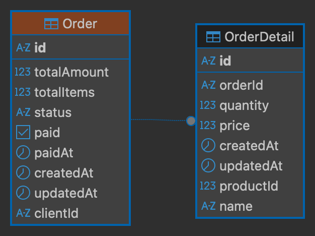

# Orders Microservice

Microservicio encargado de la gestión de órdenes, incluyendo su creación, consulta y actualización de estado. 
Se comunica con el `products-ms` mediante transporte TCP para validar los productos y obtener sus detalles.

## Características Implementadas
- **Base de Datos PostgreSQL**: Manejo y modelado de datos de órdenes mediante Prisma ORM.
- **Microservicio TCP**: Se expone únicamente internamente dentro de la red privada (Docker) mediante TCP (NestJS Microservices), bloqueando todo acceso REST directo del exterior.
- **Consultas Relacionales Óptimas**: Uso eficiente de Prisma `include` para consultar tanto la Orden como su Detalle (Order y OrderDetail) en la menor cantidad de peticiones posibles (previniendo N+1).
- **Validación de Datos**: Uso extensivo de Data Transfer Objects (DTOs) y Class Validator para validar datos al momento de crear transacciones.

## Diagrama Entidad-Relación (ER)
Modelo de base de datos gestionado en Prisma:


## Dev
1. Clonar repositorio
2. Instalar dependencias
3. Crear archivo .env basado en env.template
4. Ejecutar migración de prisma `npx prisma migrate dev`
5. Ejecutar el proyecto `npm run start:dev`

## Instantiate Postgres Database
```bash
docker compose up -d
```
